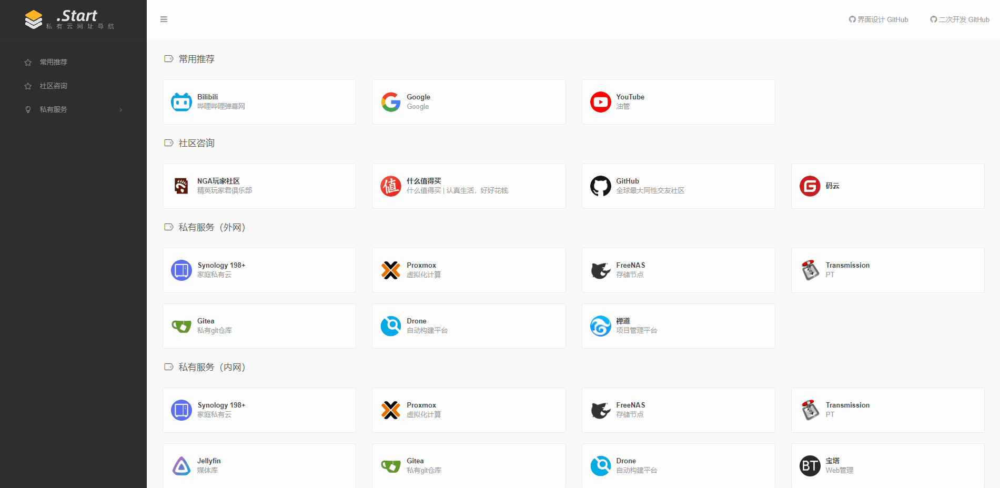

# .Start 网址导航

---

**Demo** [start.s.itzcy.com](http://start.s.itzcy.com)

本项目基于[WebStackPage](https://github.com/WebStackPage/WebStackPage.github.io) 项目二次开发而来，你可以拿来创建你自己的项目，如果有使用中的问题，欢迎[发起isset](https://github.com/itzcy/navigation/issues/new)。

#### 主要集成了以下功能

- 分类管理功能

- 网址管理功能

- 静态化生成功能

- 一键预览效果功能

> 后台入口没有做任何权限识别 可根据自己的需要进行权限管理
>
> 推荐使用指定ip可访问的方式
>
> 对了 数据库使用的是SQLlite 

### 不知道怎么部署？

> 跟我做

1. 安装PHP + nginx 环境

   1.  Linux用户

      ​	linux + php + nginx 环境请放到 `www`  目录中, 具体的安装细节请自己查找

   ​	2. 群辉用户

      ​ 群辉需要安装 `WebStation`套件和 `php` 套件，默认是nginx环境，也可以安装apache 环境

2. 部署

   把仓库下的文件放到站点目录中
   终端方式 进入 `manage` 目录执行 `composer install`

3. 访问和管理

   ​	访问你的linux地址或者群辉web地址例如 `http://192.168.1.100`

   ​	访问后正常情况会返回404地址

   ​	这时需要访问`http://192.168.1.100/manage`打开后台管理地址 后台管理没有做任何权限校验

   ​	这时你就可以增加和管理菜单和具体链接了

4. 生成缓存

   添加好菜单分类和具体链接后请在右上角点击 预览效果或更新缓存 

   - 预览效果可查看当前内容的具体效果
   - 更新缓存会在站点根目录下生成`index.html` 文件 此文件就是接下来正常访问的文件

5. 使用

   打开刚刚返回404的地址   `http://192.168.1.100`

